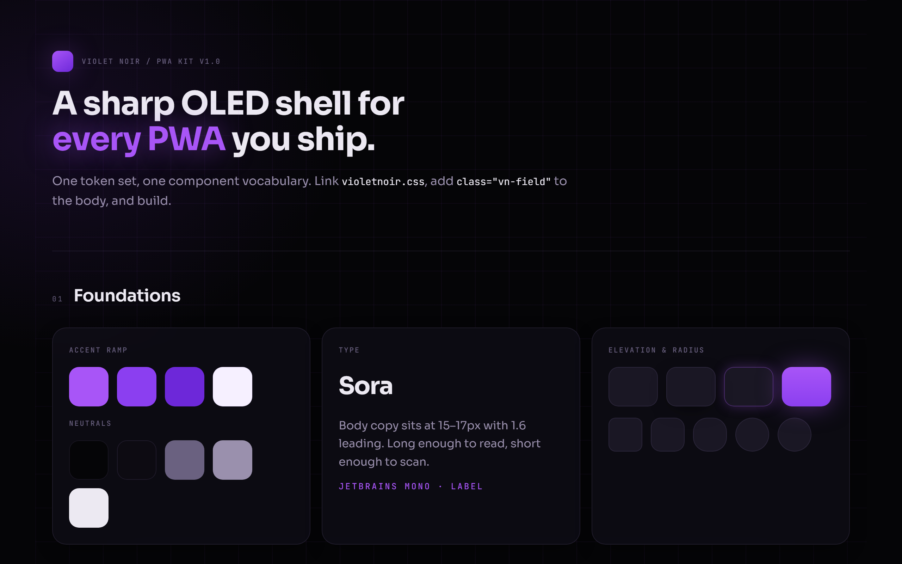

# VIOLET NOIR



A universal design language for progressive web apps. True-black OLED, glass, electric violet —
identical on a 390px phone and a 1600px desktop.

No build step, no dependencies, no framework. One stylesheet and one rules file.

```
violetnoir.css            tokens + vn-* primitives — link this
VIOLETNOIR.md             the rules file — hand this to an AI coding agent
demo/index.html           static showcase of every component
demo/manifest.webmanifest reference PWA manifest
```

## Use it in a project

```bash
curl -O https://raw.githubusercontent.com/Waguni/design_violetnoir/main/violetnoir.css
curl -O https://raw.githubusercontent.com/Waguni/design_violetnoir/main/VIOLETNOIR.md
```

```html
<meta name="viewport" content="width=device-width, initial-scale=1, viewport-fit=cover">
<meta name="theme-color" content="#050507">
<link rel="stylesheet" href="violetnoir.css">
<body class="vn-field">
```

Or, as a git submodule so every project tracks the same version:

```bash
git submodule add https://github.com/Waguni/design_violetnoir.git design
```

## Use it with Claude Code

Put this in the project's `CLAUDE.md`:

```md
## UI
All interface work follows design/VIOLETNOIR.md.
Use --vn-* tokens and vn-* classes only. Never introduce new colors,
radii, shadows or fonts. Dark theme only.
```

`VIOLETNOIR.md` is written to be read by an agent: it lists the eight
non-negotiables, the full token map, the class vocabulary, the two layout
breakpoints and the PWA patterns.

## What it covers

Buttons, chips, segmented controls, toggles · inputs, selects, textareas, search,
error states · glass cards, stat cards, panels · badges, alerts, skeletons,
spinners, empty states · tables and lists · modals, bottom sheets, toasts ·
topbar, sidebar rail, bottom nav · install prompt, offline and sync state, push
permission, splash, safe-area, pull-to-refresh.

## Principles

1. True black only — `#050507` page, translucent glass panels, never a white surface.
2. One accent — violet means active, primary, success. Nothing else is colored.
3. Glow marks the active element — high contrast is the identity, glow is not texture. Three glowing elements per screen at most.
4. Rings, not borders — inset hairline `box-shadow`, never `border: 1px solid`.
5. 44px minimum target height, desktop included.
6. Mono (JetBrains Mono) for labels, numbers and code. Sora for sentences.
7. Motion 140–260ms on one easing curve. No bounce.
8. Radii 10 / 14 / 20 / 28, pills for everything interactive.

## Family

Violet Noir is one of a set of drop-in design languages that share the same token
names, class vocabulary and rules — only the palette and type change:

- [`design_nullglow`](https://github.com/Waguni/design_nullglow) — green-glow, `ng-*`
- [`design_halcyon`](https://github.com/Waguni/design_halcyon) — frosted deep teal, `hal-*`
- **`design_violetnoir`** — OLED violet, `vn-*` (this repo)

## License

MIT
